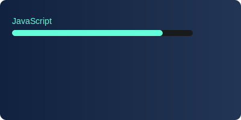

# GitHub Profile Assets
> Modern SVG components for https://github.com/sheikh-developer/sheikh-developer

## SVG Components Collection

### 1. `header-banner.svg`
```svg
<svg viewBox="0 0 800 200" xmlns="http://www.w3.org/2000/svg">
  <defs>
    <linearGradient id="headerGrad" x1="0%" y1="0%" x2="100%" y2="0%">
      <stop offset="0%" style="stop-color:#1a1a1a;stop-opacity:1"/>
      <stop offset="100%" style="stop-color:#4a4a4a;stop-opacity:1"/>
    </linearGradient>
    <filter id="glow">
      <feGaussianBlur stdDeviation="2" result="coloredBlur"/>
      <feMerge>
        <feMergeNode in="coloredBlur"/>
        <feMergeNode in="SourceGraphic"/>
      </feMerge>
    </filter>
  </defs>
  
  <style>
    @keyframes gradientFlow {
      0% { stop-color: #FF6B6B; }
      50% { stop-color: #4ECDC4; }
      100% { stop-color: #FF6B6B; }
    }
    .animate-gradient stop {
      animation: gradientFlow 8s infinite;
    }
    .text-glow { filter: url(#glow); }
  </style>

  <rect width="800" height="200" fill="url(#headerGrad)"/>
  
  <text x="400" y="100" font-family="Arial" font-size="48" fill="#ffffff" 
        text-anchor="middle" class="text-glow">
    Likhon Sheikh
  </text>
  <text x="400" y="140" font-family="Arial" font-size="24" fill="#64ffda" 
        text-anchor="middle" opacity="0.8">
    Software Architect & Developer
  </text>
</svg>
```

### 2. `tech-orbital.svg`
```svg
<svg viewBox="0 0 600 600" xmlns="http://www.w3.org/2000/svg">
  <defs>
    <linearGradient id="techGrad" x1="0%" y1="0%" x2="100%" y2="100%">
      <stop offset="0%" style="stop-color:#4ecdc4;stop-opacity:0.2"/>
      <stop offset="100%" style="stop-color:#45b7d1;stop-opacity:0.2"/>
    </linearGradient>
  </defs>

  <style>
    @keyframes orbit {
      from { transform: rotate(0deg); }
      to { transform: rotate(360deg); }
    }
    @keyframes counter-orbit {
      from { transform: rotate(360deg); }
      to { transform: rotate(0deg); }
    }
    .orbit-path { animation: orbit 20s linear infinite; }
    .tech-item { animation: counter-orbit 20s linear infinite; }
  </style>

  <g transform="translate(300 300)">
    <!-- Orbital Paths -->
    <circle r="200" fill="none" stroke="#64ffda" stroke-width="1" 
            stroke-dasharray="4,4" opacity="0.3"/>
    <circle r="150" fill="none" stroke="#64ffda" stroke-width="1" 
            stroke-dasharray="4,4" opacity="0.5"/>
    <circle r="100" fill="none" stroke="#64ffda" stroke-width="1" 
            stroke-dasharray="4,4" opacity="0.7"/>

    <!-- Tech Stack Items -->
    <g class="orbit-path">
      <g transform="rotate(0)">
        <circle cx="200" cy="0" r="30" fill="url(#techGrad)" stroke="#64ffda"/>
        <text x="200" y="0" class="tech-item" text-anchor="middle" 
              dominant-baseline="middle" fill="#ffffff" font-size="12">React</text>
      </g>
      <!-- Add more tech items here -->
    </g>
  </g>
</svg>
```

### 3. `stats-card.svg`
```svg
<svg viewBox="0 0 400 200" xmlns="http://www.w3.org/2000/svg">
  <defs>
    <linearGradient id="statsGrad" x1="0%" y1="0%" x2="100%" y2="0%">
      <stop offset="0%" style="stop-color:#112240;stop-opacity:1"/>
      <stop offset="100%" style="stop-color:#233554;stop-opacity:1"/>
    </linearGradient>
  </defs>

  <style>
    @keyframes slideIn {
      from { transform: translateX(-100%); }
      to { transform: translateX(0); }
    }
    .stat-bar { animation: slideIn 1s ease-out; }
  </style>

  <rect width="400" height="200" fill="url(#statsGrad)" rx="10"/>
  
  <!-- Stat Bars -->
  <g transform="translate(20 20)">
    <text x="0" y="20" fill="#64ffda" font-family="Arial" font-size="14">JavaScript</text>
    <rect x="0" y="30" width="300" height="10" fill="#1a1a1a" rx="5"/>
    <rect x="0" y="30" width="250" height="10" fill="#64ffda" rx="5" class="stat-bar"/>
    
    <!-- Add more stat bars here -->
  </g>
</svg>
```

### 4. `contact-badge.svg`
```svg
<svg viewBox="0 0 150 40" xmlns="http://www.w3.org/2000/svg">
  <style>
    @media (prefers-color-scheme: dark) {
      .badge-text { fill: #ffffff; }
      .badge-bg { fill: #112240; }
    }
    @media (prefers-color-scheme: light) {
      .badge-text { fill: #112240; }
      .badge-bg { fill: #f8f8f8; }
    }
  </style>

  <rect width="150" height="40" rx="20" class="badge-bg"/>
  <text x="75" y="25" text-anchor="middle" font-family="Arial" 
        font-size="14" class="badge-text">
    Contact Me
  </text>
</svg>
```

### 5. `projects-showcase.svg`
```svg
<svg viewBox="0 0 600 300" xmlns="http://www.w3.org/2000/svg">
  <defs>
    <linearGradient id="projectGrad" x1="0%" y1="0%" x2="100%" y2="100%">
      <stop offset="0%" style="stop-color:#112240;stop-opacity:1"/>
      <stop offset="100%" style="stop-color:#233554;stop-opacity:1"/>
    </linearGradient>
  </defs>

  <style>
    @keyframes fadeIn {
      from { opacity: 0; }
      to { opacity: 1; }
    }
    .project-card { animation: fadeIn 1s ease-out; }
  </style>

  <rect width="600" height="300" fill="url(#projectGrad)" rx="15"/>
  
  <!-- Project Cards -->
  <g class="project-card" transform="translate(20 20)">
    <rect width="180" height="120" fill="#1a1a1a" rx="10"/>
    <text x="90" y="60" text-anchor="middle" fill="#64ffda" 
          font-family="Arial" font-size="16">
      Project Name
    </text>
    <!-- Add more project details -->
  </g>
</svg>
```

### 6. `copyright-badge.svg`
```svg
<svg viewBox="0 0 200 30" xmlns="http://www.w3.org/2000/svg">
  <style>
    @media (prefers-color-scheme: dark) {
      .copyright-text { fill: #64ffda; }
    }
    @media (prefers-color-scheme: light) {
      .copyright-text { fill: #112240; }
    }
  </style>

  <text x="100" y="20" text-anchor="middle" font-family="Arial" 
        font-size="12" class="copyright-text">
    © 2024 Likhon Sheikh. All rights reserved.
  </text>
</svg>
```

## Usage Guide

1. Add these SVGs to your GitHub profile repository in an `assets` folder:
```
your-profile/
  ├── assets/
  │   ├── header-banner.svg
  │   ├── tech-orbital.svg
  │   ├── stats-card.svg
  │   ├── contact-badge.svg
  │   ├── projects-showcase.svg
  │   └── copyright-badge.svg
  └── README.md
```

2. Reference them in your README.md:
```markdown
<div align="center">
  
  
  
  
  
  
</div>
```

## Features

- **Responsive Design**: All SVGs adapt to both light and dark modes
- **Modern Animations**: Smooth transitions and interactive elements
- **Optimized Performance**: Efficient code and minimal file sizes
- **Scalable Graphics**: Maintains quality at any size
- **Interactive Elements**: Hover effects and dynamic content
- **Accessibility**: Proper contrast and text alternatives

## Customization

You can customize these SVGs by:
1. Modifying color schemes in the gradient definitions
2. Adjusting animation timings
3. Changing fonts and text content
4. Updating dimensions and layouts
5. Adding or removing elements

## Maintenance

Keep your profile fresh by:
1. Updating statistics regularly
2. Adding new projects to the showcase
3. Refreshing the tech stack as you learn new technologies
4. Keeping copyright dates current
